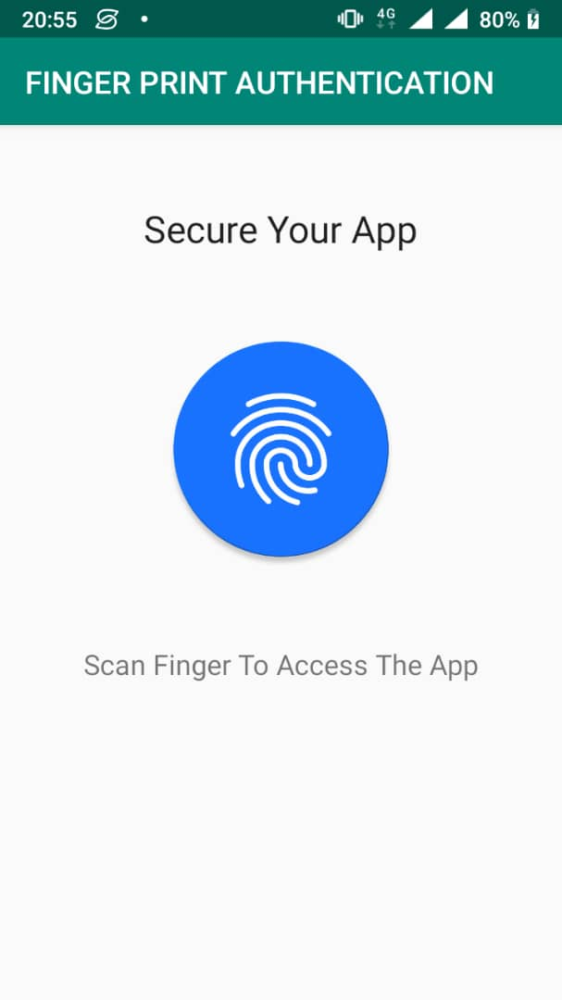
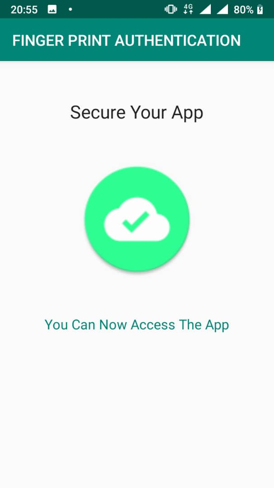

# FingerPrintAuthApp
This project is intended to implement the Finger Print (BIOMETRICS) scanner as a way to authenticate a user
for the Application.

## Prerequisites For Running The Finger Print App
- The Device should have an API level of 23 and above (above Marshmallow)
- The Device should be Finger Print Scanner enabled.
- THe Device should have atleast one security configuration such as screen Lock using PIN or password
- Atleast one Finger Print should be registered in the device

## Snapshots
### Before Scanning Finger Print

### After Scanning Finger Print

## Future Improvements